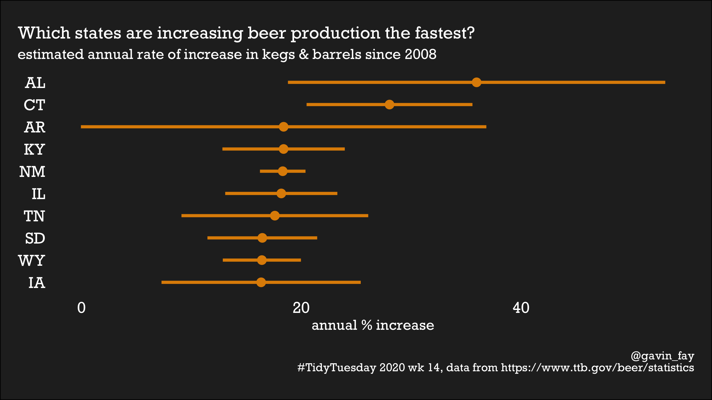

```{r setup, include=FALSE}
knitr::opts_chunk$set(echo = TRUE)
#install.packages("schrute")
library(tidyverse)
library(schrute)
```


## #TidyTuesday 2020

`TidyTuesday` is a weekly social data project in R.  
<https://github.com/rfordatascience/tidytuesday/blob/master/README.md>

This repository contains my work.  

### 2020-03-17, week 12: the Office

see [schrute.Rmd](`schrute.Rmd`)  


### 2020-03-31, week 14: beer

see [beer.Rmd](`beer.Rmd`)  




