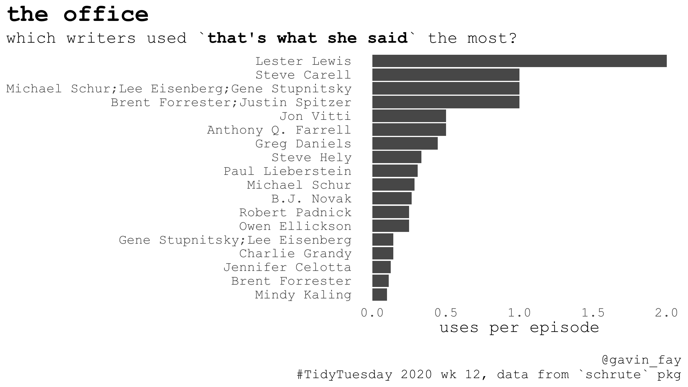
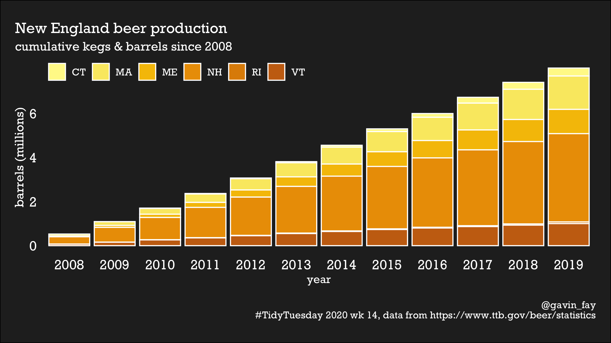
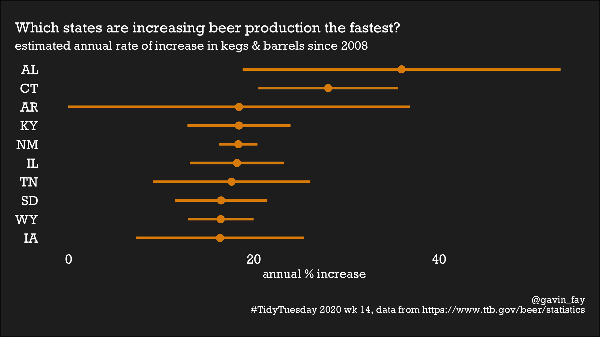

## \#TidyTuesday 2020

`TidyTuesday` is a weekly social data project in R.  
<https://github.com/rfordatascience/tidytuesday/blob/master/README.md>

This repository contains my work.

### 2020-03-17, week 12: the Office

see [schrute.Rmd](%60schrute.Rmd%60)

### 2020-03-31, week 14: beer

see [beer.Rmd](%60beer.Rmd%60)

