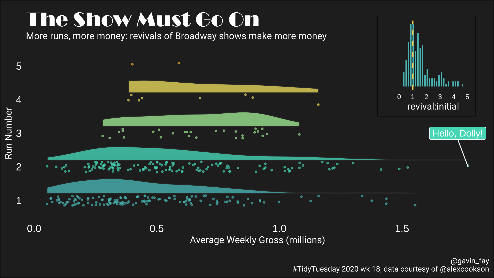

## \#TidyTuesday 2020

`TidyTuesday` is a weekly social data project in R.  
<https://github.com/rfordatascience/tidytuesday/blob/master/README.md>

This repository contains my work.

### 2020-07-14, week 29: Astronauts

see [astronauts.Rmd](astronauts.Rmd)

### 2020-04-28, week 20: volcanoes

see [volcano.Rmd](volcano.Rmd) (combined \#TidyTuesday with Mother’s
Day)

### 2020-04-28, week 18: Broadway shows

see [broadway.Rmd](broadway.Rmd)

### 2020-04-14, week 16: rap tracks

see [rappers.Rmd](rappers.Rmd)

### 2020-03-31, week 14: beer

see [beer.Rmd](beer.Rmd)

### 2020-03-17, week 12: the Office

see [schrute.Rmd](schrute.Rmd)

